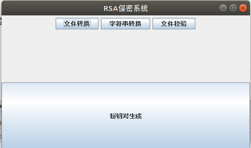
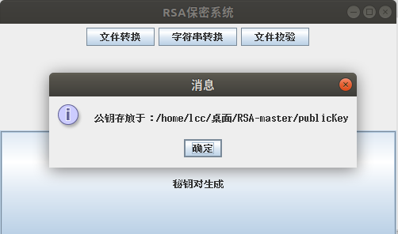
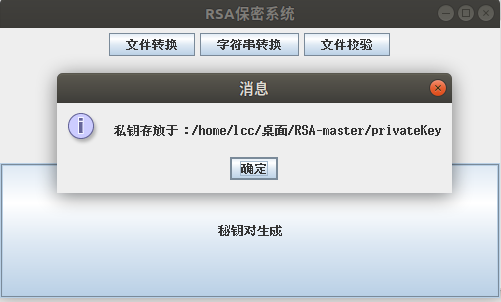
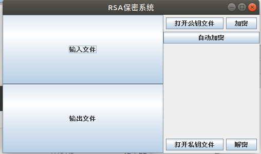
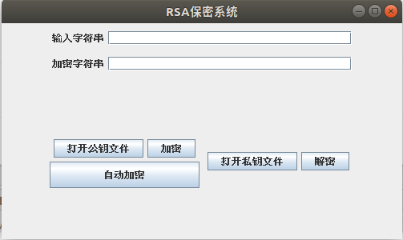
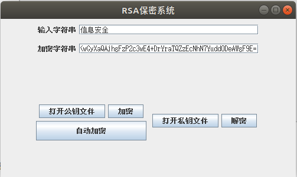
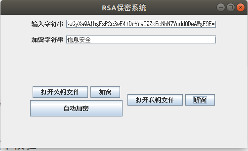
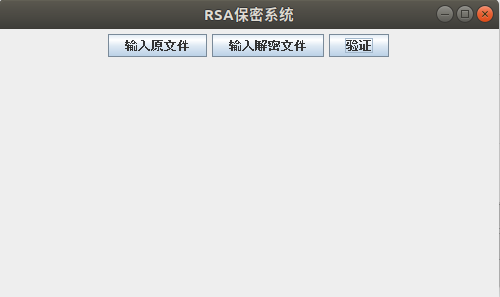
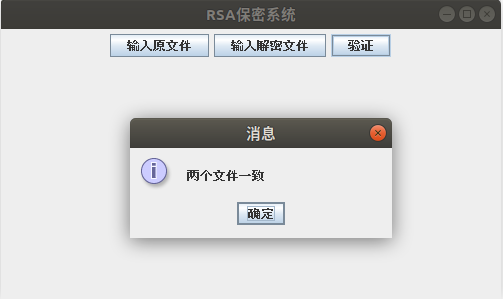

RSA保密系统
===

### 一、首页

#### 1. 包含三个主体部分

- 文件转换
- 字符串转换
- 签名(文件)校验

#### 2. 秘钥对生成

### 二、　文件加密

#### 1. 加密功能

点击`输入文件`按钮，得到输入文件

点击`输出文件`按钮，得到输出文件名，和相应路径

(1) 打开公钥文件，加密

点击`打开公约文件`

点击`加密`

(2) 自动加密

点击`自动加密`功能

文件自动加密到 输入文件 同一文件夹下

（自动产生公钥和私钥都会存放于同一文件夹下）

#### 2. 解密功能

点击`输入文件`按钮，获得加密后的文件

点击`输出文件`， 得到解密文件存储路径，和文件名

点击`打开私钥文件`， 点击`解密`，  可得到相应文件

#### 3. 注

文件转换格式不限，文件字节长度只要在Int表示范围内即可

### 三、 字符串转换

#### 1. 加密

同上，包含自动加密，和输入公钥加密两种功能

（仅仅将输入输出文件，转换成 输入输出框）

#### 2. 解密

同上（仅仅将输入输出文件，转换成 输入输出框）

### 四、签名文件校验

结果展示：

